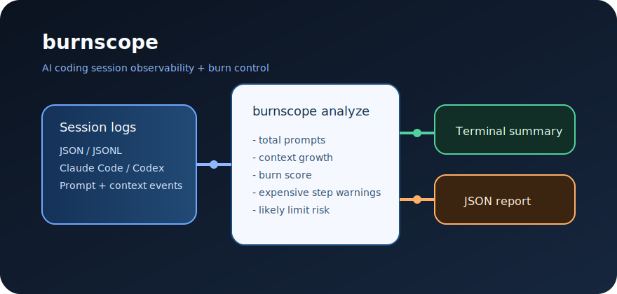

# burnscope

`burnscope` is a fast TypeScript CLI for one painful question every heavy AI coding session creates: are we still moving, or are we quietly burning budget and heading toward context limits?

It ingests session event logs from Claude Code, Codex, or similar agentic coding tools and turns them into a local burn report with zero dashboard work.



## Why this exists

Long coding sessions drift. Prompts get bigger, context balloons, slow steps pile up, and nobody notices until the model gets expensive, sluggish, or close to hard limits. `burnscope` gives you a fast local checkpoint before that happens.

## Pains solved

- You cannot quickly explain why a session suddenly got expensive.
- Prompt count alone hides the real cost driver: compounding context growth.
- Agentic sessions produce "one bad step" moments that are easy to miss.
- Teams need a machine-readable artifact they can save, diff, or feed into later automation.

## Benefits

- Works locally as a CLI, so it is fast to ship and easy to automate.
- Reads plain JSON or JSONL logs.
- Computes the MVP signals that actually matter: prompt volume, context growth, burn score, expensive steps, and limit risk.
- Prints a human summary and writes a JSON report for pipelines.

## MVP scope

- TypeScript CLI
- JSON / JSONL ingestion
- Session analysis engine
- Terminal summary
- JSON report output
- Sample session data
- Tests for the analysis logic

## Quickstart

```bash
cd /Users/mulugeta/.openclaw/workspace/burnscope
npm install
npm run demo
```

You can also analyze your own log file:

```bash
npx tsx src/cli.ts /path/to/session.jsonl --report reports/custom-report.json
```

## Demo

Demo input:

```bash
samples/demo-session.jsonl
```

Demo command:

```bash
npm run demo
```

Example terminal output:

```text
burnscope
---------
Prompts: 5
Prompt tokens: 8300
Completion tokens: 2980
Peak context: 24100
Context growth: 24100
Estimated burn score: 10.66 (healthy)
Likely limit risk: high - Context is already large and recent steps are trending toward session limits.
Expensive steps:
- 2026-03-30T08:18:48.000Z rewrite-parser: large prompt, slow step (prompt=2100, context=12100, durationMs=98000, impact=3.02)
- 2026-03-30T08:51:17.000Z debug-failure: large prompt, heavy context, slow step, high burn impact (prompt=2400, context=24100, durationMs=132000, impact=4.44)

JSON report written to reports/demo-report.json
```

Example JSON report shape:

```json
{
  "product": "burnscope",
  "source": "samples/demo-session.jsonl",
  "generatedAt": "2026-03-30T00:00:00.000Z",
  "analysis": {
    "totalPrompts": 5,
    "totalContextGrowth": 24100,
    "estimatedBurnScore": 18.61,
    "expensiveStepWarnings": [],
    "likelyLimitRisk": {
      "level": "high"
    }
  }
}
```

## JSON log format

Each line or JSON object can contain:

```json
{
  "ts": "2026-03-30T08:18:48.000Z",
  "type": "prompt",
  "step": "rewrite-parser",
  "promptTokens": 2100,
  "completionTokens": 760,
  "contextTokens": 12100,
  "durationMs": 98000,
  "model": "codex"
}
```

## Commands

```bash
npm run demo
npm test
npm run build
```

## Design notes

- No web app. CLI-first by design for speed and low overhead.
- Minimal dependencies: TypeScript + `tsx`.
- Heuristic burn scoring is intentionally simple in this MVP so it is easy to audit and replace later.

## Next obvious extensions

- Per-model cost estimation
- Session comparison across runs
- Threshold configuration flags
- CI budget gates
